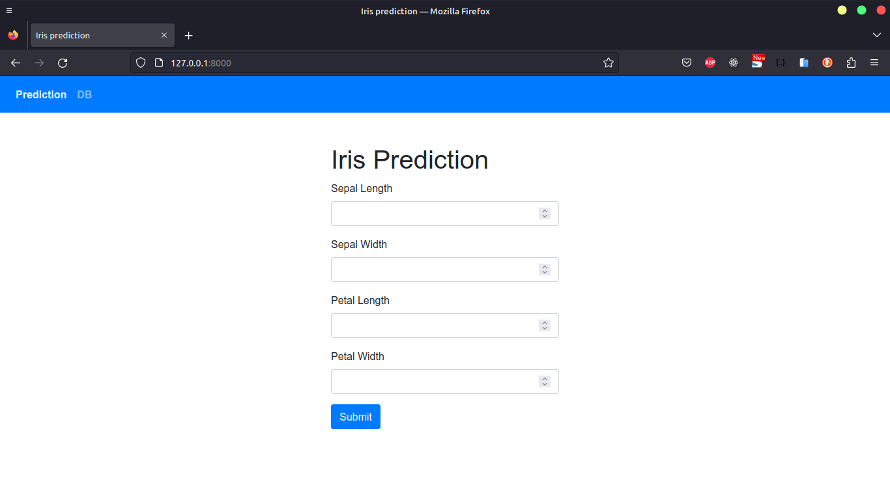

## Iris Flower Prediction

> Iris Flower Prediction using Machine Learning.
> In this project, our goal is to predict Iris flower species based on various features such as _sepal length, sepal width, petal length, petal width_. We will perform all steps from _Data collection to Model implementation_. During Model evaluation, we compare different machine learning algorithms based on the accuracy_score metric and find the best one. Then we create a web application using Django which is a micro python framework.

# **Screenshot**

# **Features**

- Prediction
- Predict Result/DB

# Installation

- Clone this repository and unzip it.

- After downloading, `cd` into the `iris` directory.

- Begin a new virtual environment with Python 3 and activate it.

- Install the required packages using
  `pip install -r requirements.txt`

- Execute the command:
  `python manage.py runserver 3000`

- Open http://127.0.0.1:3000/ in your browser.
